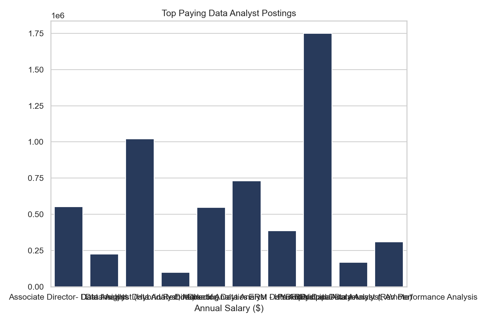
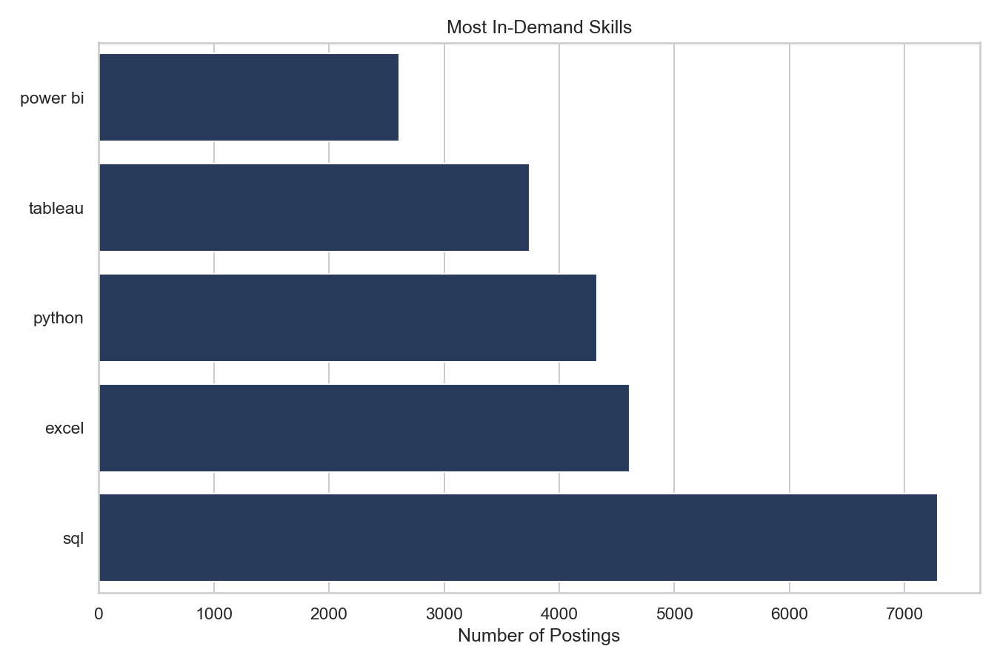
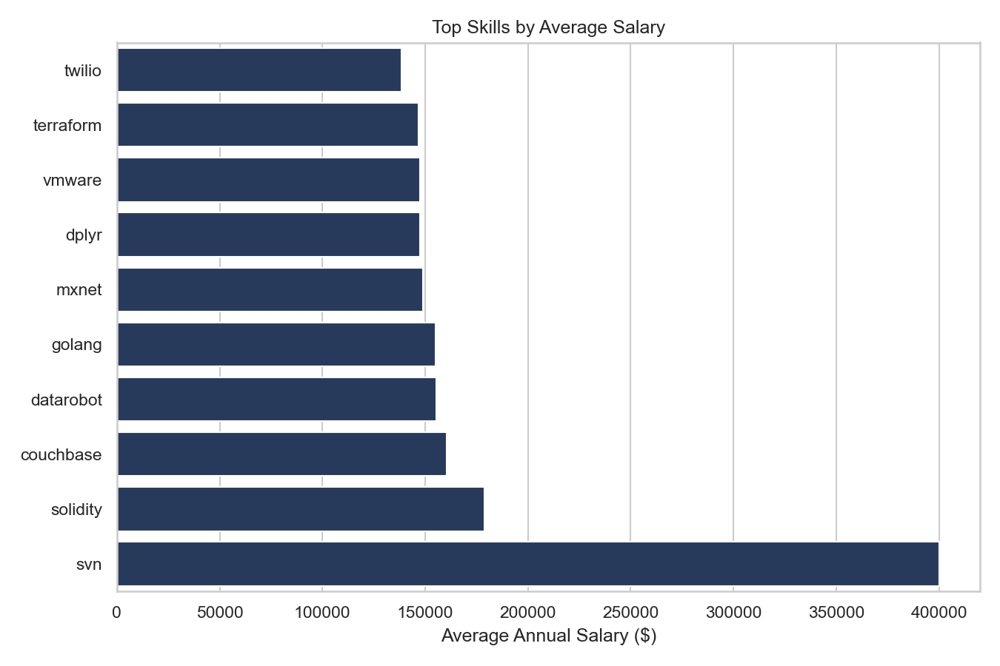

# 📊 SQL Job Market Analysis for Data Analyst Roles

A SQL-based exploratory analysis of the Data Analyst job market using PostgreSQL, complemented with Python visualizations to uncover salary trends, in-demand skills, and high-value career opportunities.

---

## Project Objective

Businesses make hiring decisions based on data, and job seekers make career decisions the same way.

This project analyzes thousands of Data Analyst job postings to answer questions like:

- Which Data Analyst jobs pay the highest salaries?
- Which skills are required for those high-paying roles?
- What skills are most in demand?
- Which technical skills offer the highest salary potential?
- Which skills provide the best combination of demand and compensation?

The analysis demonstrates practical SQL querying, data exploration, and visualization skills expected in Business Analyst and Data Analyst roles.

---

# 🛠 Tech Stack

- PostgreSQL
- SQL
- Python
- Pandas
- Matplotlib
- Seaborn
- psycopg2
- python-dotenv

---

# Project Structure

```text
job_data_analysis_sql/
│
└── insights_sql/
    ├── images/
    │   ├── top_paying_jobs.png
    │   ├── most_in_demand_skills.png
    │   └── top_skills_by_salary.png
    │
    ├── visual.py
    ├── 1top_paying_jobs.sql
    ├── 2skills_required_for_top_jobs.sql
    ├── 3most_in_demand_skills.sql
    ├── 4top_skills_based_on_salary.sql
    └── 5high_demand_high_paying_skills.sql
```

---

# Analysis Performed

| SQL Script | Business Question |
|------------|------------------|
| `1top_paying_jobs.sql` | Which Data Analyst jobs offer the highest salaries? |
| `2skills_required_for_top_jobs.sql` | Which skills are required for those high-paying jobs? |
| `3most_in_demand_skills.sql` | Which skills appear most frequently in job postings? |
| `4top_skills_based_on_salary.sql` | Which skills command the highest average salaries? |
| `5high_demand_high_paying_skills.sql` | Which skills provide the best balance of demand and salary? |

---

# Visualizations

The Python visualization pipeline automatically generates charts for:

- Top Paying Data Analyst Jobs
- Most In-Demand Skills
- Top Skills by Average Salary

These charts are saved in:

```
insights_sql/images/
```

---

# 📷 Results

## 💰 Top Paying Data Analyst Jobs



---

## 🔥 Most In-Demand Skills



---

## 💵 Top Skills by Average Salary



---

# ⚙️ Running the Project

### Clone the repository

```bash
git clone https://github.com/mumal123/job_data_analysis_sql.git
cd job_data_analysis_sql
```

### Install dependencies

```bash
pip install -r requirements.txt
```

### Create a `.env`

```env
PGHOST=your_host
PGDATABASE=your_database
PGUSER=your_username
PGPASSWORD=your_password
PGPORT=5432
```

### Generate visualizations

```bash
python insights_sql/visual.py
```

---

# 💡 Key Skills Demonstrated

- SQL Joins
- Common Table Expressions (CTEs)
- Aggregations
- Window Functions
- Filtering & Sorting
- Business Metrics
- Data Cleaning
- Data Visualization
- Exploratory Data Analysis
- PostgreSQL
- Python Automation

---

# 📌 Business Insights

- High-paying Data Analyst roles often require specialized technical skills.
- SQL remains one of the most consistently requested skills across job postings.
- Certain niche technologies command significantly higher average salaries than general-purpose tools.
- Combining salary analysis with demand helps identify skills with the highest career ROI.

---

## ⭐ If you found this project useful, consider giving it a star!